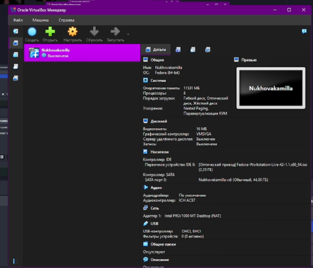
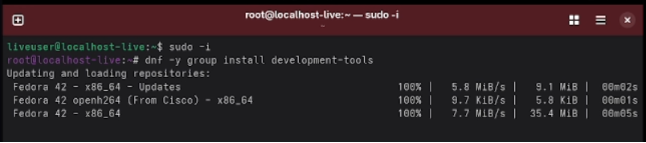
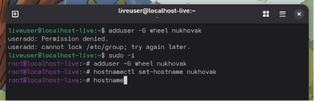
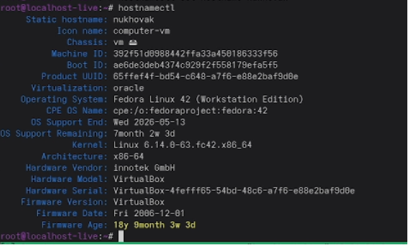

**Лабораторная работа № 1**

Цель работы

- Целью данной работы является приобретение практических навыков установки операционной системы на виртуальную машину, настройки минимально необходимых для дальнейшей работы сервисов.

Ход работы

1. Устанавливаем ОС на виртуальную машину

   

1. Открываем cmd и вводим команды

   

Устанавливаем необходимые элементы для работы в ОС

Добавляем юзернейм и хостнейм после проверяем корректность 

Выполняем команду для анализа загрузки системы 

- Вывод: приобретение практических навыков установки операционной системы на виртуальную машину, настройки минимально необходимых для дальнейшей работы сервисов.

