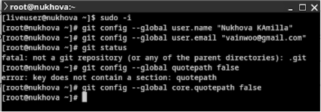
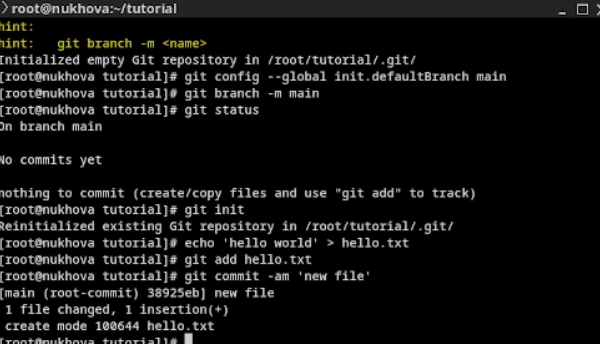
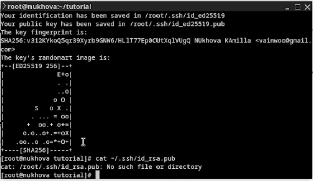
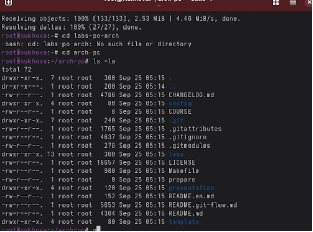

**Лабораторная работа № 2**

Цель работы

- Изучить идеологию и применение средств контроля версий.
- Освоить умения по работе с git.

Ход работы

- Создаем локальный репозиторий.

Сначала сделаем предварительную конфигурацию, указав имя и email владельца репозитория:

git config --global user.name "Имя Фамилия"

git config --global  user.email "work@mail" и Настроим utf-8 в выводе сообщений git

- После это в каталоге tutorial появится каталог .git, в котором будет храниться история изменений.

  Создадем тестовый текстовый файл hello.txt и добавим его в локальный репозиторий.\
  

  Прописываем шаблоны игнорируемых при добавлении в репозиторий типов файлов в файл .gitignore с помощью сервисов.

Создаем ключи ssh

Заверешение работы

- Вывод: Изучили идеологию и применение средств контроля версий.
- Освоили умения по работе с git.

