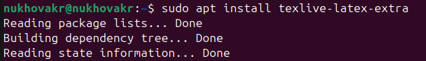
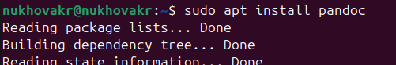
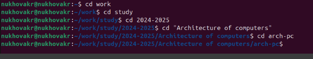
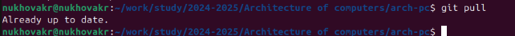
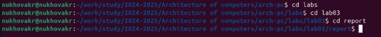
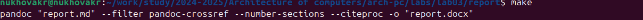
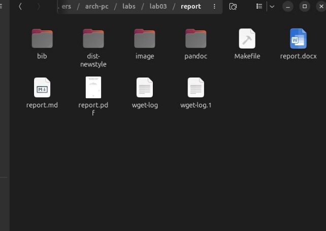
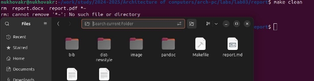
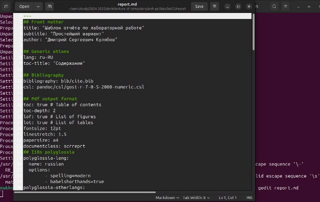

**РОССИЙСКИЙ УНИВЕРСИТЕТ ДРУЖБЫ НАРОДОВ** 

**Факультет физико-математических и естественных наук Кафедра прикладной информатики и теории вероятностей** 

**ОТЧЕТ**  

**ПО ЛАБОРАТОРНОЙ РАБОТЕ № 3**  

*дисциплина:  Архитектура компьютера *

Студент:     Нухова Камилла Руслановна         Группа: НБИбд-01-24         

**МОСКВА** 2024 г. 

**3. Лабораторная работа №3.** Язык разметки Markdown**  

3\.1. Цель работы  

Целью  работы  является  освоение  процедуры  оформления  отчетов  с  помощью легковесного языка разметки Markdown. 

3\.4 Порядок выполнения лабораторной работы  

1. Устанавливаем техническое обеспечение, такое как: tex live и pandoc, С помощью команды sudo apt install  

Рисунок 1 

Рисунок 2 

2. Переходим к каталогу курса сформированный при выполнении лабораторной работы №2. 

Рисунок 3 

Следующий  шаг  –  обновление  локального  репозитория,  скачав  изменения  из удаленного репозитория с помощью команды “git pull” 

Рисунок 4 

3. Переходим в каталог с шаблоном отчета по лабораторной работе номер три 

Рисунок 5 

4. Проводим компиляцию шаблона с использованием Markfile. Делаем мы это с помощью команды “make” 

Рисунок 6 

Рисунок 7 

Рисунок 8 

5. Далее открываем файл report.md через терминал 

Рисунок 9 

6. Загружаю файлы на Github.  

Вывод:  освоила  процедуры  оформления  отчетов  с  помощью  легковесного  языка разметки Markdown. 
