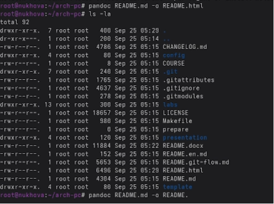
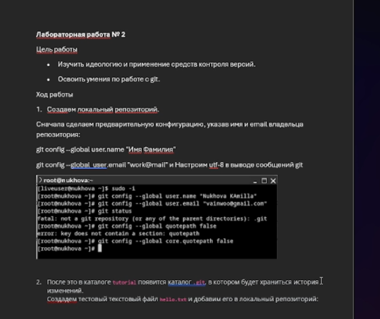
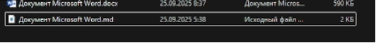

Лабораторная работа № 3. Markdown

` `3.1. Цель работы Научиться оформлять отчёты с помощью легковесного языка разметки Markdown.

Ход работы.

Создаем отчет в разрешение docx pdf и md

\
Вывод: Научились оформлять отчеты с помощью языка markdown
