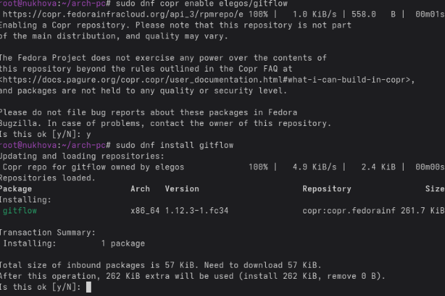
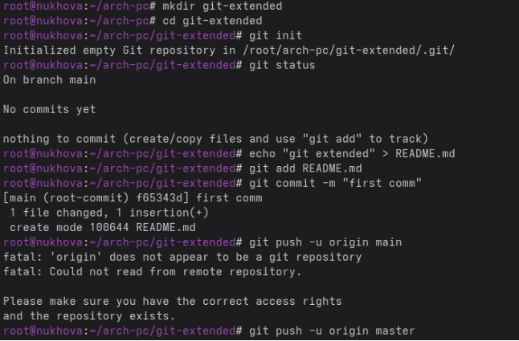
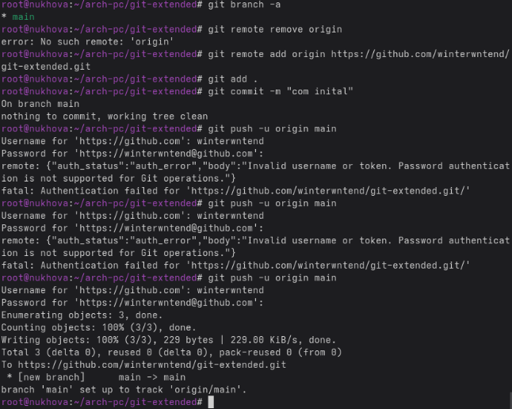
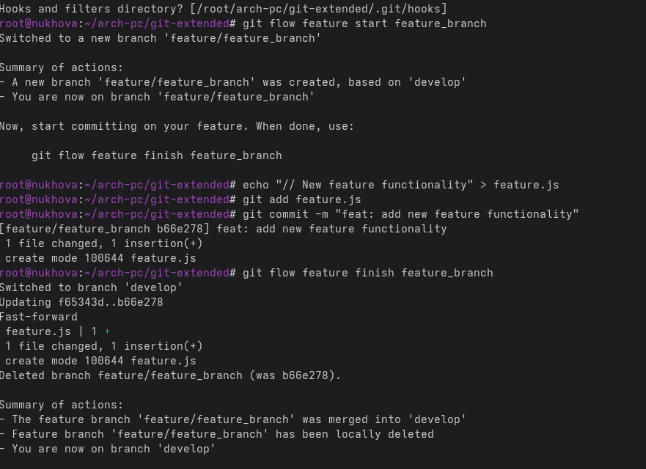
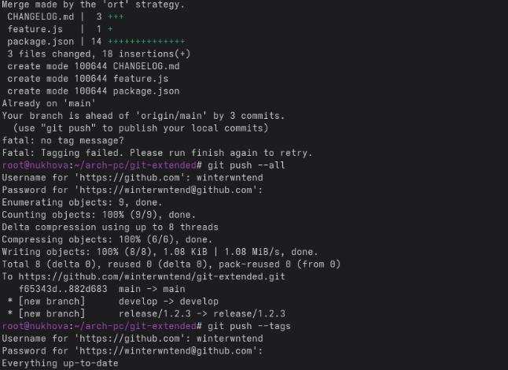

**Лабораторная работа № 4**

Цель работы

- Получение навыков правильной работы с репозиториями git.

Ход работы

Установка giflow

Создание git extended

Разработка новой функциональности

Вывод: получены навыки работы с репозиторием
