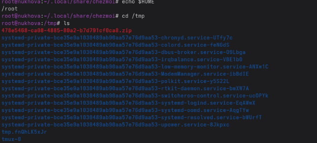
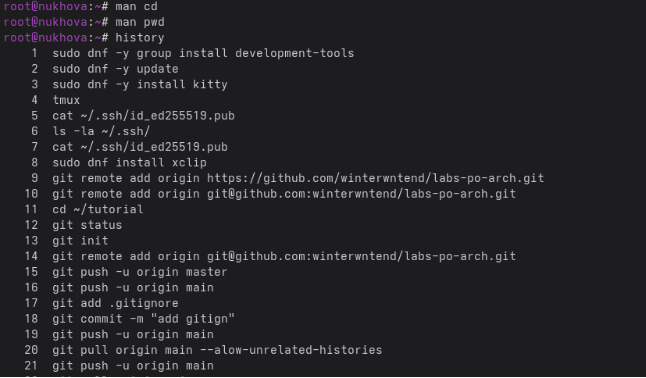
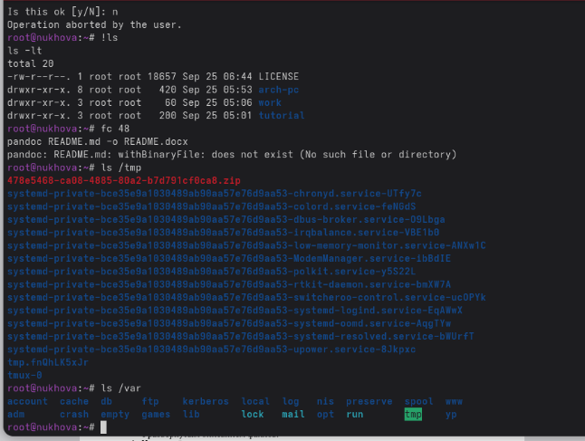

Лабораторная работа № 4. Основы интерфейса взаимодействия

пользователя с системой Unix на уровне командной строки

4\.1. Цель работы

Приобретение практических навыков взаимодействия пользователя с системой по-

средством командной строки.

