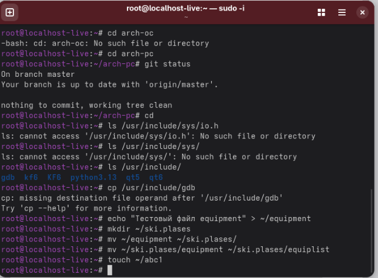
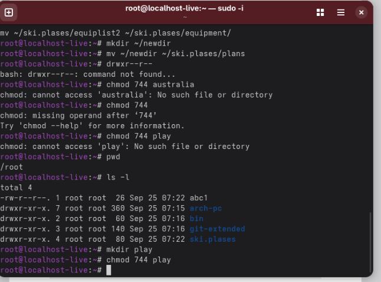
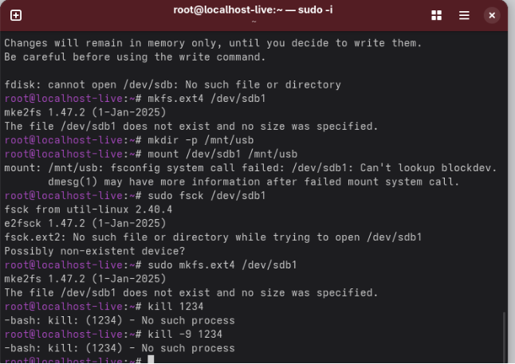

Лабораторная работа № 5. 

Анализ файловой системы Linux. Команды для работы с файлами и каталогами\
5\.1. Цель работы Ознакомление с файловой системой Linux, её структурой, именами и содержанием каталогов. Приобретение практических навыков по применению команд для работы с файлами и каталогами, по управлению процессами (и работами), по проверке использования диска и обслуживанию файловой системы.

Выполняем копирование файлов

Смотрим директорию и проверяем работоспособность команд

Проверяем команды

Вывод: Ознакомились с файловой системой linux
