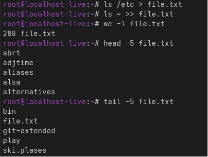
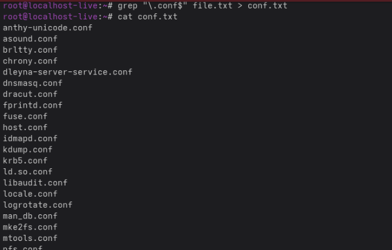
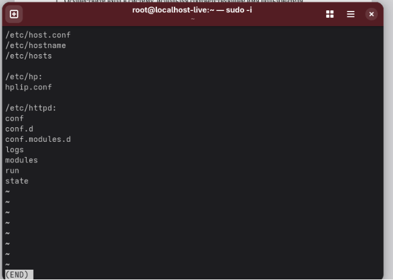
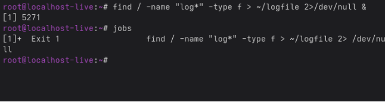
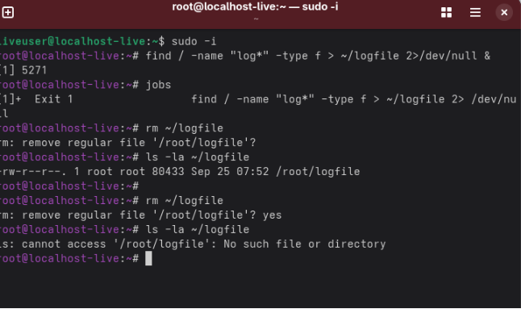
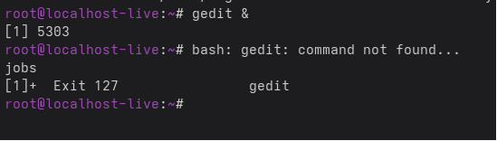
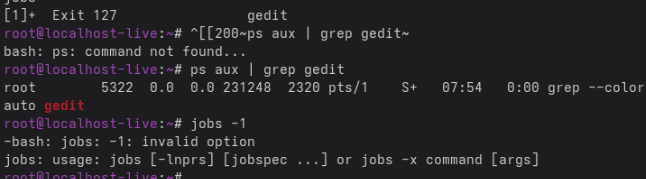
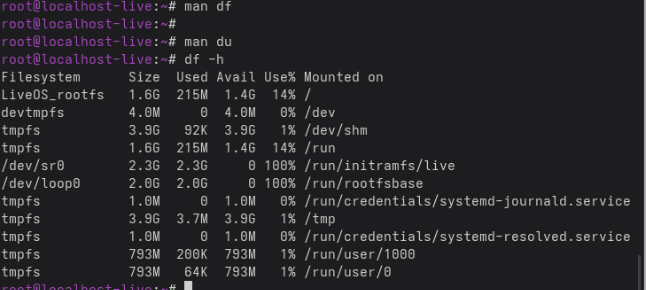

Лабораторная работа № 6. Поиск файлов. Перенаправление ввода-вывода. Просмотр запущенных процессов 

6\.1. Цель работы Ознакомление с инструментами поиска файлов и фильтрации текстовых данных. Приобретение практических навыков: по управлению процессами (и заданиями), по проверке использования диска и обслуживанию файловых систем

Ход работы

Запись названия файла в txt

Фильтрация файлов с расширением con\

**5. Вывод файлов из /etc, начинающихся на 'h' (постранично)**

**5. Вывод файлов из /etc, начинающихся на 'h' (постранично)**

Вывод файлов из /etc\

Фоновый процесс записи файлов\

Удаление файла log file

Запуск gedit

Определение id процессора

Использование команд df и du

Вывод: ознакомились с инструментами поиска файлов и фильтрации текстовых данных

