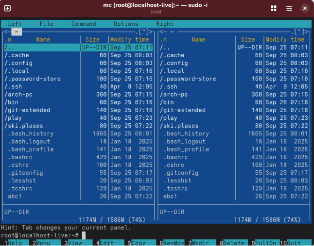
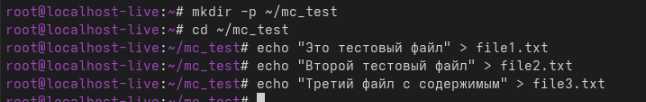
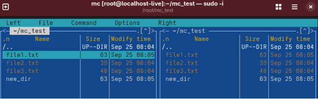
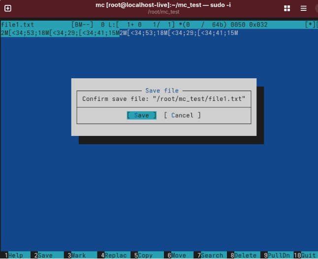
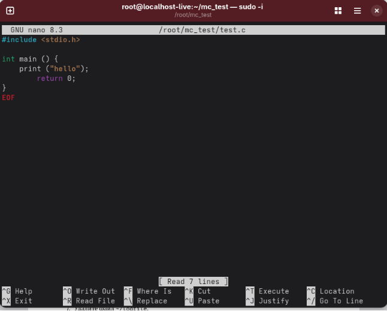

Лабораторная работа № 7. Командная оболочка Midnight Commander

` `7.1. Цель работы Освоение основных возможностей командной оболочки Midnight Commander. 

Ход работы

Изучение работы mc

Создание текствого файла для работы с mc

Работа с кодом программирования 

Вывод: Освоение основных возможностей командной оболочки Midnight Commander.
