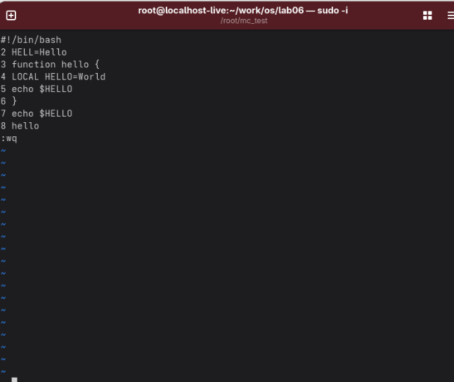
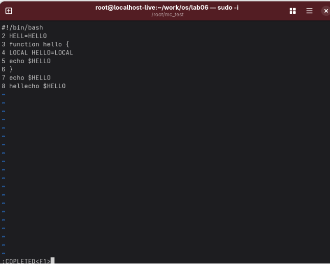

Лабораторная работа № 8. Текстовой редактор vi 

8\.1. Цель работы Познакомиться с операционной системой Linux. Получить практические навыки работы с редактором vi, установленным по умолчанию практически во всех дистрибутивах.

Задание 1. Создание нового файла с использованием vi

Создание файла с помощью vi

Делаем файл исполняемым 

Задание 2. Редактирование существующего файла

