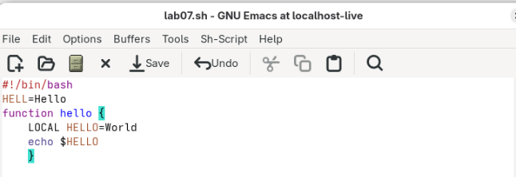
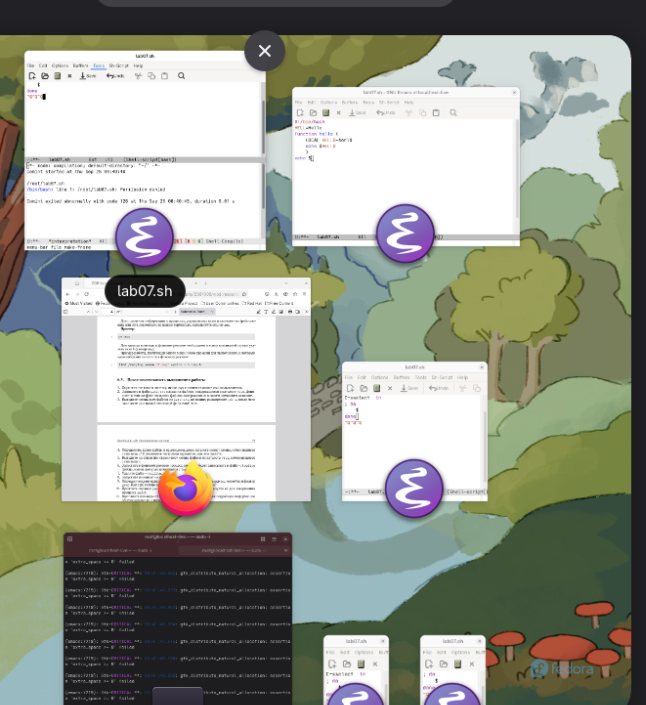

Лабораторная работа № 9. Текстовой редактор emacs 

9\.1. Цель работы Познакомиться с операционной системой Linux. Получить практические навыки работы с редактором Emacs.

Создания файла в emacs и ввод текста

Открытие новых окон в emacs

