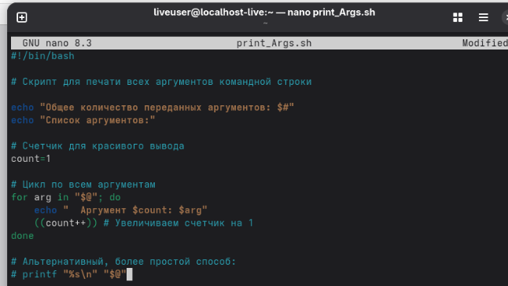
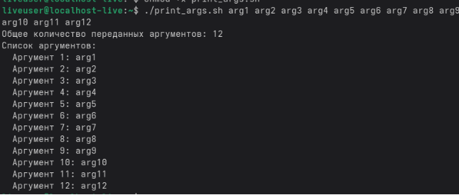
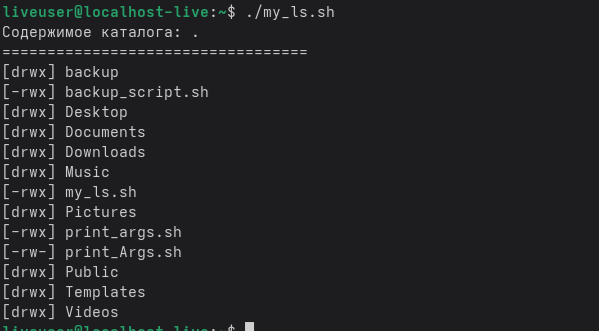
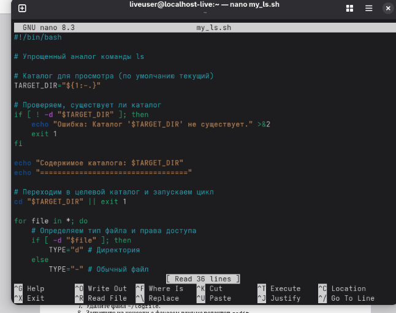
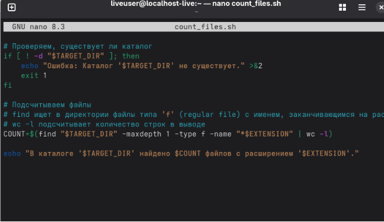
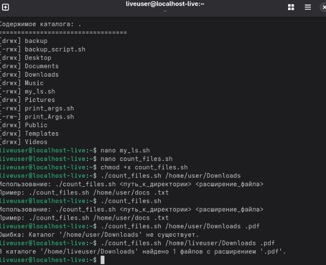

Лабораторная работа № 10. Программирование в командном процессоре ОС UNIX. Командные файлы 

10\.1. Цель работы Изучить основы программирования

Первый код: 

#!/bin/bash

\# Скрипт для резервного копирования самого себя

\# 1. Определяем переменные

\# Имя этого скрипта

SCRIPT\_NAME="$0"

\# Домашний каталог пользователя

HOME\_DIR="$HOME"

\# Директория для бэкапов

BACKUP\_DIR="$HOME\_DIR/backup"

\# Имя архивного файла (используем базовое имя скрипта и дату)

BACKUP\_FILE="$BACKUP\_DIR/$(basename $SCRIPT\_NAME).$(date +%Y-%m-%d).tar.gz"

\# 2. Создаем директорию backup, если её нет

if [ ! -d "$BACKUP\_DIR" ]; then

`    `mkdir -p "$BACKUP\_DIR"

`    `echo "Создана директория для резервных копий: $BACKUP\_DIR"

fi

\# 3. Создаем архив (tar.gz)

\# Флаг -c - создать архив

\# Флаг -z - сжать с помощью gzip

\# Флаг -f - указать имя файла

\# Флаг -P - сохранять абсолютные пути (чтобы точно найти скрипт)

tar -czPf "$BACKUP\_FILE" "$SCRIPT\_NAME"

\# 4. Проверяем успешность создания архива

if [ $? -eq 0 ]; then

`    `echo "Резервная копия успешно создана: $BACKUP\_FILE"

else

`    `echo "Ошибка при создании резервной копии!" >&2

`    `exit 1

fi

2 код: 

Третий код: 

\

Четвертый код:

Вывод:  Изучили основы программирования
