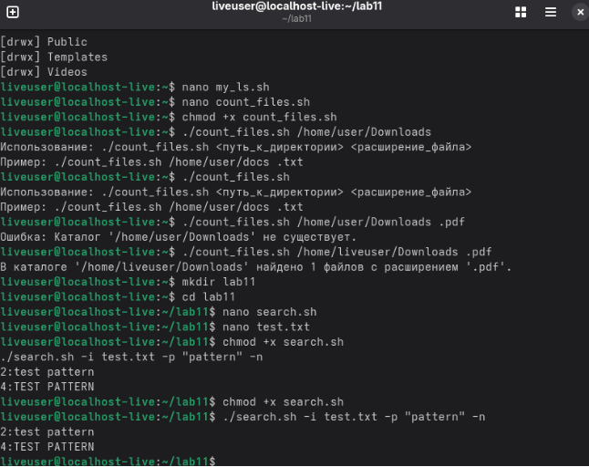
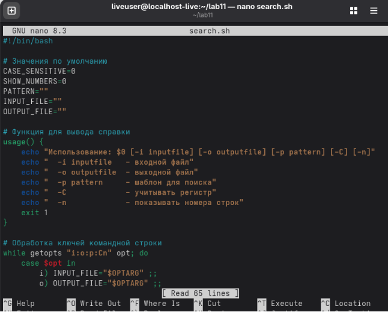
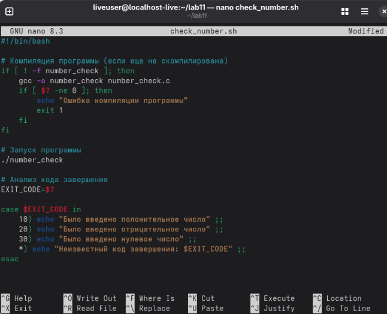
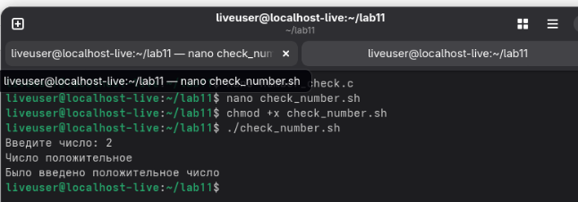
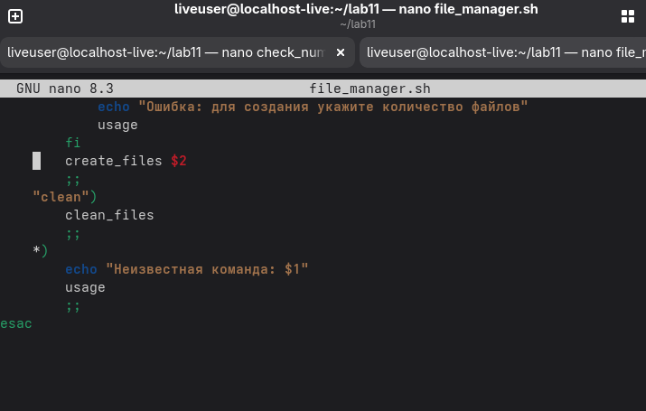
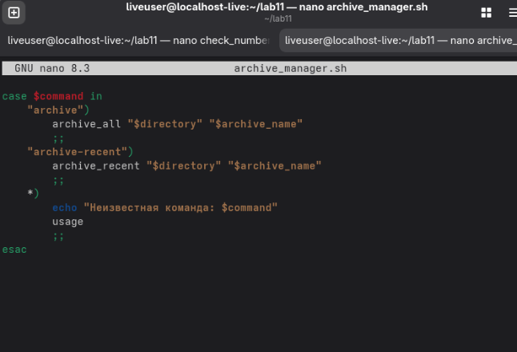
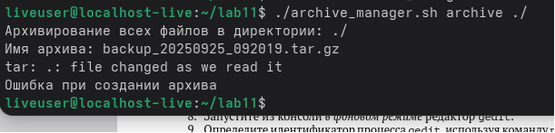

Лабораторная работа № 11. Программирование в командном процессоре ОС UNIX. Ветвления и циклы 

11\.1. Цель работы Изучить основы программирования в оболочке ОС UNIX. Научится писать более сложные командные файлы с использованием логических управляющих конструкций и циклов.

Ход работы 

Первый код:

Второй код:

Третий код:

Четвертый код:

