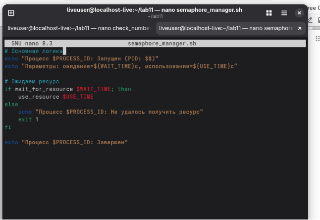
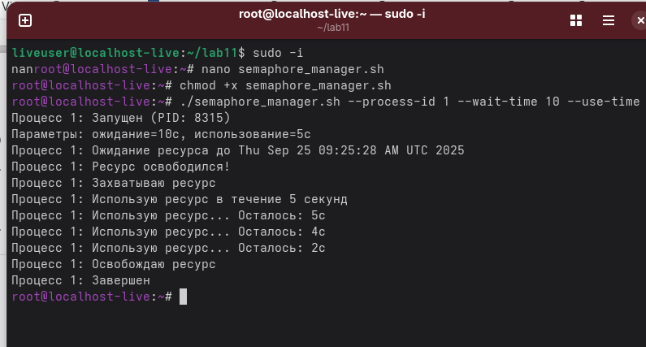
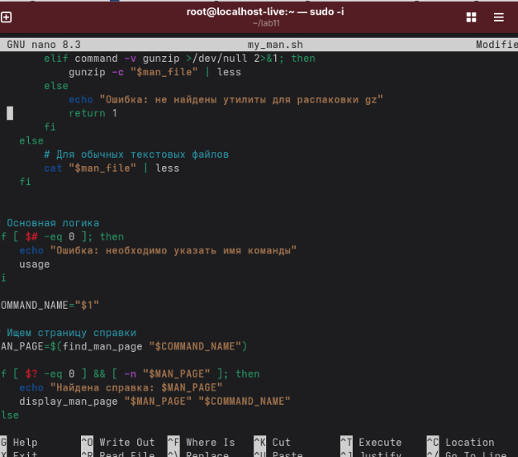
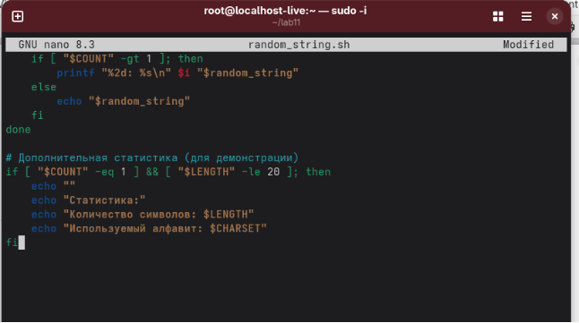
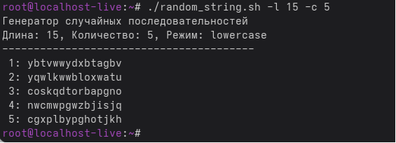

Лабораторная работа № 12. Программирование в командном процессоре ОС UNIX. Расширенное программирование

` `12.1. Цель работы Изучить основы программирования в оболочке ОС UNIX. Научиться писать более сложные командные файлы с использованием логических управляющих конструкций и циклов.

Первыйкод:

Второй код: 

Третий код: 

Вывод: изучили основы программирования
